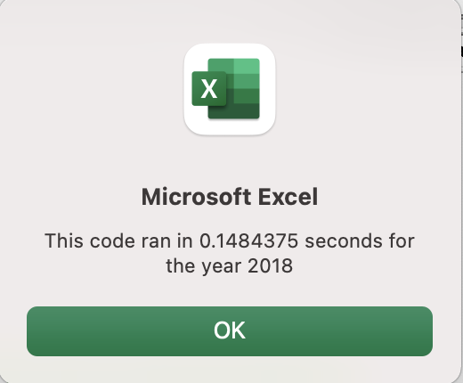

# stocks_analysis
## Overview of Project
##### Purpose
   The purpose of this analysis was to help Steve analyze the enitre stock market for his parents over the last few years with refactored code. The goal was to make the analysis faster as it looped through the entire data set one time.
#### Code
    To refactor the code for the entire stock market analysis the Range needed to be marked for any year value. There for "yearvalue" was added in exchange for any year represented in the code as seen below.
  
    Sheets("All Stocks Analysis").Activate
        
        Range("A1").Value = "All Stocks (" + yearValue + ")"
 
Additionally, to loop through all the tickers in one loop, a ticker index was added to tickers. This aloowed the code to iterate through all tickers. 
```
    For i = 0 To 11
        
            ticker = tickers(i)
```
To iterate through all selected values to find the starting price, ending price, and total volume for the tickers, "If statements" allowed the code to check all values in closing for each ticker in the selected year.
```
Find the total volume for the current ticker.

                 If Cells(j, 1).Value = ticker Then
        
                         totalVolume = totalVolume + Cells(j, 8).Value
        
                End If
'Find the starting price for the current ticker.

    If Cells(j - 1, 1).Value <> ticker And Cells(j, 1).Value = ticker Then
        
        startingprice = Cells(j, 6).Value
        
    End If
    
'Find the ending price for the current ticker.

     If Cells(j + 1, 1).Value <> ticker And Cells(j, 1).Value = ticker Then
        
        Endingprice = Cells(j, 6).Value
        
    End If
    
    Next j
'Output the data for the current ticker.

    Worksheets("All Stocks Analysis").Activate
    
        Cells(4 + i, 1).Value = ticker
        
        Cells(4 + i, 2).Value = totalVolume
        
        Cells(4 + i, 3).Value = Endingprice / startingprice - 1

Next i
```
To determine the effect of the refactoring on the speed of the code a timer was set as seen in the full set of code below.
```
Sub AllStocksAnalysis()

'Set Timer

Dim startTime As Single
Dim endTime As Single

'year analysis

    yearValue = InputBox("What year would you like to run the analysis on?")
    
    startTime = Timer
    
'Format the output sheet on the "All Stocks Analysis" worksheet.
    Sheets("All Stocks Analysis").Activate
        
        Range("A1").Value = "All Stocks (" + yearValue + ")"
        
'Create a header row
        Cells(3, 1).Value = "Ticker"
        Cells(3, 2).Value = "Total Daily Volume"
        Cells(3, 3).Value = "Return"

'Initialize an array of all tickers.
    Dim tickers(11) As String
    
        tickers(0) = "AY"
        
        tickers(1) = "CSIQ"
        
        tickers(2) = "DQ"
        
        tickers(3) = "ENPH"
        
        tickers(4) = "FSLR"
        
        tickers(5) = "HASI"
        
        tickers(6) = "JKS"
        
        tickers(7) = "RUN"
        
        tickers(8) = "SEDG"
        
        tickers(9) = "SPWR"
        
        tickers(10) = "TERP"
        
        tickers(11) = "VSLR"


'Prepare for the analysis of tickers.


'Initialize variables for the starting price and ending price.

     Dim startingprice As Single
     Dim Endingprice As Single
   
'Activate the data worksheet.

    Sheets(yearValue).Activate
    
'Find the number of rows to loop over.
RowCount = Cells(Rows.Count, "A").End(xlUp).Row

'Loop through the tickers.

         For i = 0 To 11
        
            ticker = tickers(i)
            totalVolume = 0
'Loop through rows in the data.
         Sheets(yearValue).Activate
         
            For j = 2 To RowCount
        
'Find the total volume for the current ticker.

                 If Cells(j, 1).Value = ticker Then
        
                         totalVolume = totalVolume + Cells(j, 8).Value
        
                End If
'Find the starting price for the current ticker.

    If Cells(j - 1, 1).Value <> ticker And Cells(j, 1).Value = ticker Then
        
        startingprice = Cells(j, 6).Value
        
    End If
    
'Find the ending price for the current ticker.

     If Cells(j + 1, 1).Value <> ticker And Cells(j, 1).Value = ticker Then
        
        Endingprice = Cells(j, 6).Value
        
    End If
    
    Next j
'Output the data for the current ticker.

    Worksheets("All Stocks Analysis").Activate
    
        Cells(4 + i, 1).Value = ticker
        
        Cells(4 + i, 2).Value = totalVolume
        
        Cells(4 + i, 3).Value = Endingprice / startingprice - 1

Next i
        
  endTime = Timer
    MsgBox "This code ran in " & (endTime - startime) & "second for the year " & (yearValue)
        
End Sub
```
## Results: 
When running the refactored code with the timer to measure the speed. Both 2017 and 2018 were about a second faster. This may seem like a small amount, but with large amounts of data it can make a huge difference. 
##### The 2017 Refactored Code Timing


##### The 2018 Refactored Code timing


## Summary: In a summary statement, address the following questions.
### What are the advantages or disadvantages of refactoring code?
Refactoring code has the obvious upsides of speed and clean script. When the code is refactored it runs better and it looks better which would help in the future if this is code that will often be used. However, the disadvantage is that it is time consuming. You may have to get a project done for a client right away and their just is not enough time to complete the refactoring of the code.
###How do these pros and cons apply to refactoring the original VBA script?
  The original VBA Script wa definitely slower and did not allow for easy changes to the entire stock market data. If any data was added, this would have been timing consuming and later uses would require edits. Although it is a time consuming process, the refactoring of the VBA Script allowed the code to run faster and give Steve the results for additional data. Refactoring seems to be the best option, no matter the time it takes, when the code needs to be replicated often and used by largeer data sets
